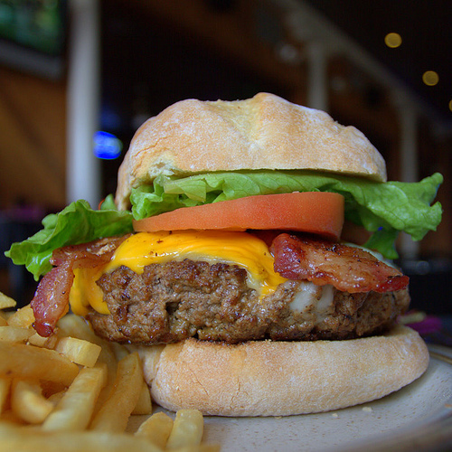
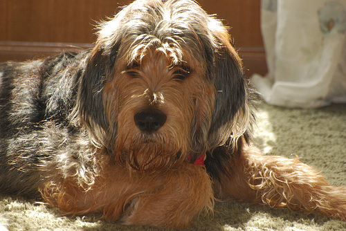

# Лабораторная работа 3

## Цель
Изучить основы реализации глубоких нейронных сейтей на мобильных системах, а также методы их оптимизации.

## Вариант
Используемая нейросеть: resnet18

## Теория
ResNet-18 (Residual Network, 18 слоев) - это глубокая архитектура сверточных нейронных сетей, принадлежащая семейству ResNet. ResNet была представлена Каймингом Хе, Сянью Чжан, Шаочинг Реном и Джиан Суном в их статье 2016 года "Deep Residual Learning for Image Recognition". Основной задачей ResNet было решение проблем обучения очень глубоких нейронных сетей.

Основные характеристики ResNet-18:
1. Остаточное обучение:
ResNet вводит концепцию остаточного обучения, которая включает использование соединений-переходов для пропуска одного или нескольких слоев в сети. Эти соединения-переходы позволяют модели изучать остаточные функции, упрощая обучение глубоких сетей путем уменьшения проблемы исчезающего градиента.

2. Структура базового блока:
ResNet-18 состоит из серии базовых строительных блоков, которые повторяются для формирования общей архитектуры. Каждый базовый блок обычно включает два сверточных слоя с небольшими фильтрами 3x3, нормализацию по батчу и активации rectified linear unit (ReLU). Соединение-переход добавляет вход к выводу этих сверточных слоев.

3. Понижение размерности:
ResNet-18 использует понижение размерности с помощью сверток с шагом или максимальной пулинга для уменьшения пространственных размеров карт признаков. Это понижение размерности обычно применяется на ранних слоях для захвата низкоуровневых признаков на более высоких разрешениях и на поздних слоях для захвата высокоуровневых признаков на более низких разрешениях.

4. Количество слоев:
ResNet-18, в частности, имеет 18 слоев, что делает его относительно компактным вариантом по сравнению с более глубокими версиями, такими как ResNet-34, ResNet-50 и так далее. Архитектура разработана таким образом, чтобы балансировать сложность модели и производительность для различных задач компьютерного зрения.

5. Применение:
ResNet-18 обычно используется для задач классификации изображений, где он продемонстрировал высокую производительность на стандартных наборах данных, таких как ImageNet. Из-за его относительно небольшого размера по сравнению с более глубокими вариантами ResNet, он часто предпочтителен в сценариях с ограниченными вычислительными ресурсами.

## Описание программы
Программа выполняет задачу классификации изображении с помощью нейросети ResNet18, предобученной на ImageNet датасете.

### Преобразование изображения в подходящий для нейросети формат
```python
convert_tensor = T.ToTensor()
transforms = nn.Sequential(
            T.Resize([256, ]),
            T.CenterCrop(224),
            T.ConvertImageDtype(torch.float),
            T.Normalize([0.485, 0.456, 0.406], [0.229, 0.224, 0.225])
        )
def transform_image(image): 
    tensor_image = convert_tensor(image)
    transformed_image = transforms(tensor_image)
    return torch.unsqueeze(transformed_image, 0).cuda()
```

### Загрузка модели и классификация изображения 
```python
resnet = resnet18(pretrained=True).eval().cuda()

start = time.time()
for path, image in images.items():
    output = resnet(image)
    print_result(path, output)
end = time.time()
```

### Оптимизация модели с помощью TensotRT и классификация изображения 
```python
if not os.path.exists(model_path):
    path, image = next(iter(images.items()))
    resnet_trt = torch2trt(resnet, [image], max_workspace_size=1<<30, use_onnx=False)
    torch.save(resnet_trt.state_dict(), model_path)
else:
    resnet_trt = TRTModule()
    resnet_trt.load_state_dict(torch.load(model_path))

start = time.time()
for path, image in images.items():
    output = resnet_trt(image)
    print_result(path, output)
end = time.time()
```

## Результаты

Программа выполняет классификацию 10 [изображений](./images).

Примеры изображений:
### Burger

### Dog


### Результат работы программы
```
Running resnet18
Predicted result for images/dog.JPEG : 201, silky_terrier
Predicted result for images/white_bear.JPEG : 296, ice_bear
Predicted result for images/dumbbell.JPEG : 543, dumbbell
Predicted result for images/burger.JPEG : 933, cheeseburger
Predicted result for images/sloth.JPEG : 364, three-toed_sloth
Predicted result for images/fish.JPEG : 1, goldfish
Predicted result for images/sneakers.JPEG : 770, running_shoe
Predicted result for images/rabbit.JPEG : 331, hare
Predicted result for images/lizard.JPEG : 41, whiptail
Predicted result for images/bird.JPEG : 142, dowitcher
Avg time: 8.2842 seconds
Used memory: 0.41 MB

Running resnet18 optimized by TensorRT
Predicted result for images/dog.JPEG : 201, silky_terrier
Predicted result for images/white_bear.JPEG : 296, ice_bear
Predicted result for images/dumbbell.JPEG : 543, dumbbell
Predicted result for images/burger.JPEG : 933, cheeseburger
Predicted result for images/sloth.JPEG : 364, three-toed_sloth
Predicted result for images/fish.JPEG : 1, goldfish
Predicted result for images/sneakers.JPEG : 770, running_shoe
Predicted result for images/rabbit.JPEG : 331, hare
Predicted result for images/lizard.JPEG : 41, whiptail
Predicted result for images/bird.JPEG : 142, dowitcher
Avg time: 0.3309 seconds
Used memory: 559.68 MB
```

## Вывод
 Оптимизация с использованием TensorRT существенно сократила время выполнения классификации, а именно с 8,2 секунд до 0,3, что дает прирост в проихводительности в ~27 раз. Однако оптимизированная версия нейросети потребляет в ~1000 раз больше оперативной памяти. Что касается возможности применения системы в реальном времени, то на тестовом оборудовании система не будет показываать положительных результатов обработки изображений в реальном времени, т.к. наивысшая частота кадров будет составлять 3fps. 